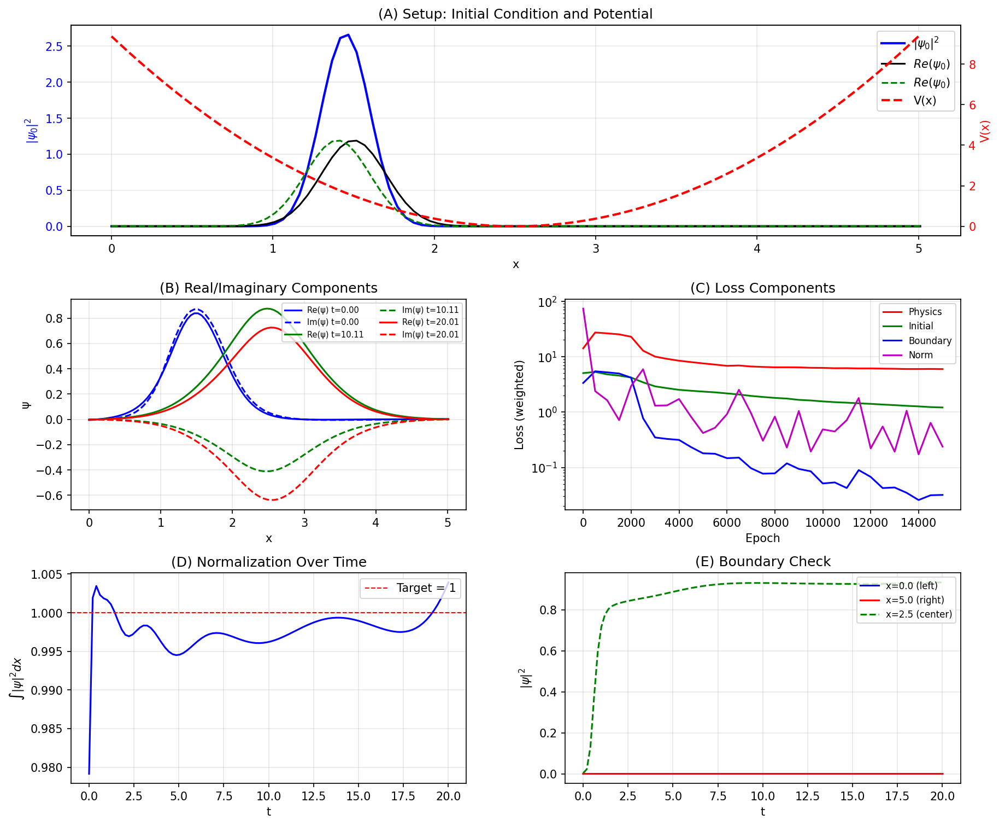
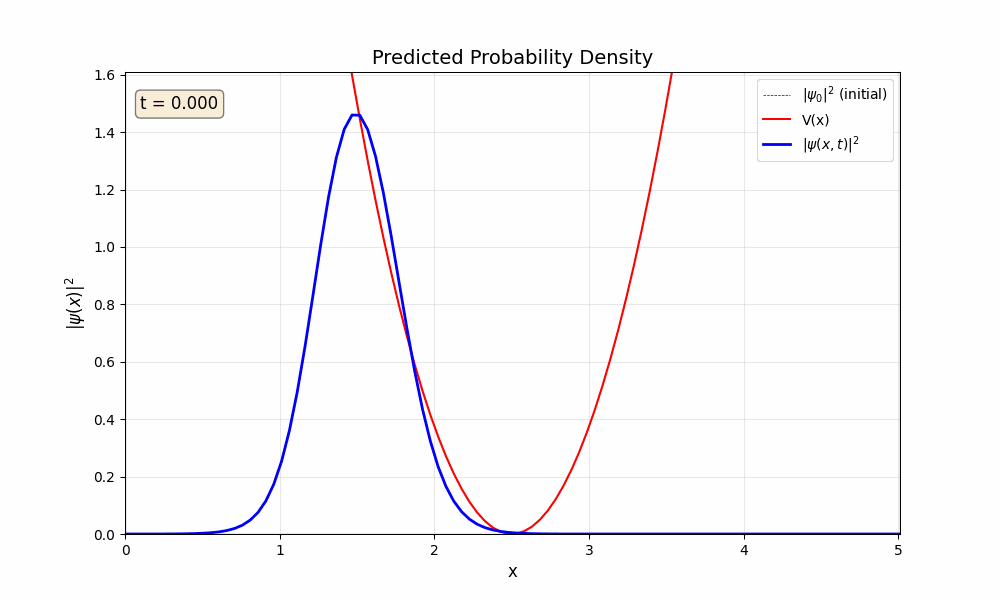

# PINN for Solving Schrödinger's Equation

Traditional numerical methods for solving PDEs require a discretized space and time mesh grid. This limits the resolution of the solution to the coordinates in the input grid. A Physics-Informed Neural Network (PINN) can overcome this limitation by learning a generalizable solution that can be extended beyond input coordinates.
The PINN in this project learns a mapping $(x, t) \to \psi(x, t)$. Because this mapping is continuous, you can query the solution at any arbitrary resolution without being limited to the points used during training.

## Background

The time-dependent Schrödinger equation governs how quantum states evolve:

$$i\hbar \frac{\partial \psi}{\partial t} = -\frac{\hbar^2}{2m}\frac{\partial^2 \psi}{\partial x^2} + V(x)\psi$$

ψ(x, t) is a complex-valued wave function whose squared magnitude |ψ|² gives the probability density of finding a particle at position x at time t. According to Schrödinger equation, the time evolution of ψ depends on both the kinetic energy (the spatial curvature term) and the potential energy V(x).

## PINN

A standard neural network would need labeled data—pairs of (x, t) inputs and ψ values to learn from. But we don't have that data for a hypothetical quantum wave packet; we only have the differential equation itself. The PINN approach embeds the physics directly into the training process.

The network takes coordinates (x, t) and outputs the real and imaginary parts of ψ. We then use automatic differentiation to compute the derivatives ∂ψ/∂t and ∂²ψ/∂x², plug them into the Schrödinger equation, and penalize any residual. The loss function has four components:

1. **PDE residual**: Is the PDE being satisfied? This is equivalent to enforcing $$i\hbar \frac{\partial \psi}{\partial t} +\frac{\hbar^2}{2m}\frac{\partial^2 \psi}{\partial x^2} - V(x)\psi = 0.$$
2. **Initial condition**: Does ψ(x, 0) match the inital Gaussian wave packet?
3. **Boundary conditions**: Does ψ vanish at the domain boundaries?
4. **Normalization**: Does ∫|ψ|²dx = 1 for all times?

By minimizing this combined loss, the network learns a wave function that satisfies both the physics and the constraints.

### Adaptive Loss Weights

Finding the right balance of loss weights is challenging: if one term dominates, the network may converge to a trivial solution that ignores other constraints. This project supports Learning Rate Annealing (LRA) from Wang, Teng & Perdikaris (2021), which dynamically adjusts weights based on gradient magnitudes so all loss terms contribute equally to parameter updates.

## Usage

```bash
# Install dependencies
pip install -r requirements.txt

# Train with default settings
python train.py

# Train with a different potential
python train.py --potential harmonic

# Create an animation of the wave evolution
python train.py --animate

# Enable adaptive loss weights (LRA)
python train.py --adaptive-weights
python train.py --adaptive-weights --lra-tau 0.8 --lra-update-freq 50

# Run inference on a trained model
python infer.py --run-id <run_id>
python infer.py --run-id <run_id> --animate
```

Trained models and plots are saved to `runs/<run_id>/`.

## Sample Outputs




## Configuration

Key parameters can be set via command line or in `configs/default.yaml`. Use the --help tag to learn more.

**Potentials**: `gaussian` (barrier/well), `harmonic` (oscillator), `infinite_well`

**Network**: Hidden layer dimensions, activation function (tanh, silu, gelu)

**Training**: Learning rate, number of epochs, loss term weights, adaptive weight scheduling

**Domain**: Spatial and temporal bounds, grid resolution

See `configs/default.yaml` for the full configuration with documentation.

## Takeaways

1. **Loss Weights**: The convergence of the PINN to a sensible solution is dependent on how each component of the loss is weighted. For example, if the physics loss is weighed too highly, then the network can converge to a constant flat line, which is a correct solution to the PDE had the initial wave packet also been a constant flat line. In this case, the network is ignoring the initial condition component of the loss. Unfortunately, finding the right set of weights requires some trial and error.

2. **Activation function**: The activation function being used is also very important to reach a correct solution. A stepwise-linear activation function like the ReLu has a zero second-order derivative. This makes it a poor choice to learn a system like Schrodinger's equation, which involves taking a second-order derivative of the network's output. See Rowan, C. (2025).

3. **Optimizer**: Lastly, the type of optimizer used can impact how fast and accurately the network learns. According to Rathore, Pratik, et al (2034), using Adam followed by L-BFGS improves performance. This has been the case for the PINN used in this project. To test this, use results from a training run, and switch the optimizer in `SchrodingerTrainer` from Adam to L-BFGS and retrain using the weights from the initial training.

## References

- Rathore, P., Lei, W., Frangella, Z., Lu, L., & Udell, M. (2024). Challenges in training pinns: A loss landscape perspective. arXiv preprint arXiv:2402.01868. [https://arxiv.org/pdf/2402.01868](https://arxiv.org/pdf/2402.01868)
- Rowan, C. (2025). On the failure of ReLU activation for physics-informed machine learning. arXiv preprint arXiv:2512.11184. [https://arxiv.org/pdf/2512.11184](https://arxiv.org/pdf/2512.11184)
- Wang, S., Teng, Y., & Perdikaris, P. (2021). Understanding and mitigating gradient flow pathologies in physics-informed neural networks. SIAM Journal on Scientific Computing, 43(5), A3055-A3081. [https://arxiv.org/abs/2001.04536](https://arxiv.org/abs/2001.04536)
